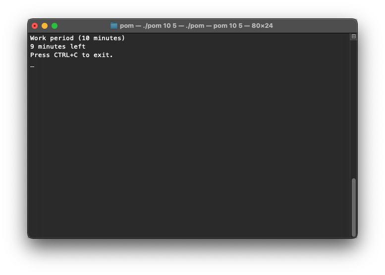

# Pom

*A dead simple macOS terminal-based pomodoro timer utility.*

All you do is just do `pom <work minutes> <break minutes>` and it'll count down the minutes and give you a notification when it's time to take a break or get back to work.

If you want something more heavy duty, check out [pomo.sh by jsspencer](https://github.com/jsspencer/pomo)

Made in an hour or two by [@jwhamilton_](https://www.twitter.com/jwhamilton_)

Licensed under the [MIT License](https://mit-license.org/).